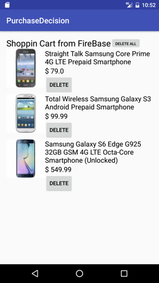

## Screen Shot

## Description of APP
This app compare prices from WalMart, Ebay and Best buy.Also, it search twitt about the item.

First, user input item of interest in Wart Search engine. The app shows the serach reslut which
is the list of item. And then this app search Ebay and BestBuy for individual item in WalMart Search item. The Ebay has many sellers. It shows range of prices. Also, this app shows twitts of each item.

A user can saved the search result in shopping card. The shopping cart is save in Firebase.
So the user can access it with any smart phone or computer.

The user can compare prices anywhere that it has cell phone signal.

## Design Process
when I desinged it, I focused on readibitly of data. This app has many data from 4 APIs.
Most important things is to deliver the information effectively. If too many information in a singles
activity, a user may be confused and would not like to read it. The twitts messages is placed in other
screen to simplify the app. 

There are numberless android phones which have various screen size. The small screen may not show
all information which can be showed in screen. The font size should be carfully chosed. Or we can 
ajdust the amount of information in a screen according to screen size.

## Unsolved problems
