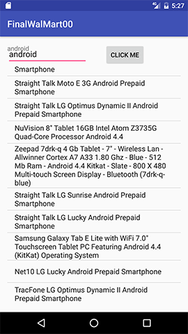

## User Stroies
As a user, I can search item in WalMart.
As a user, I can see the result of ebay, best buy search by this app.
AS a user, I can can search twitter.
As a user, I can save the item in FireBase.

## Survery
	### Question
	1. Which website do you use for online shopping?
	2. What do you shop in online shopping mall?
	3. How do you compare price?

	### Participants
	1. JiYeon Yoon - Female, in 20s, Flushing 08/27/2016
	2. SeungIl Yu - Male, in 50s, Fort Lee NJ 08/27/2016
	3. HyunSeung Lee  - Female, in 40s, Old Tappan NJ 08/28/2016

	### Answers
	#### JiYoen Yoon
	1. WalMart
	2. Cosmetics
	3. visiting many website

	### SeungIl yu 
	1. Ebay
	2. Electrinics
	3. Price compare site

	### HynunSeung Lee
	1. BestBuy
	2. Home Appliance
	3. Go to many stores

## Project Pitch Slide
https://docs.google.com/presentation/d/1RYFI9gokiEO59hTiijiTwXyDU3HAh4_wGqy2cMa4ftI/edit#slide=id.p

## ProType

